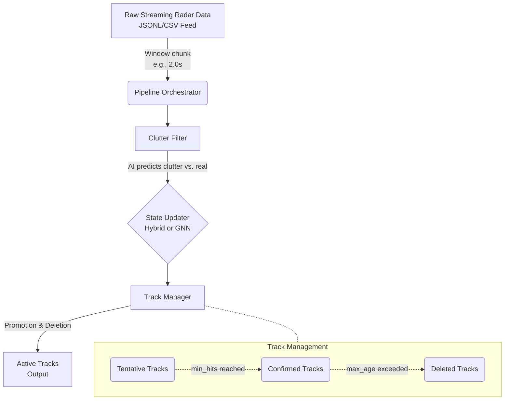
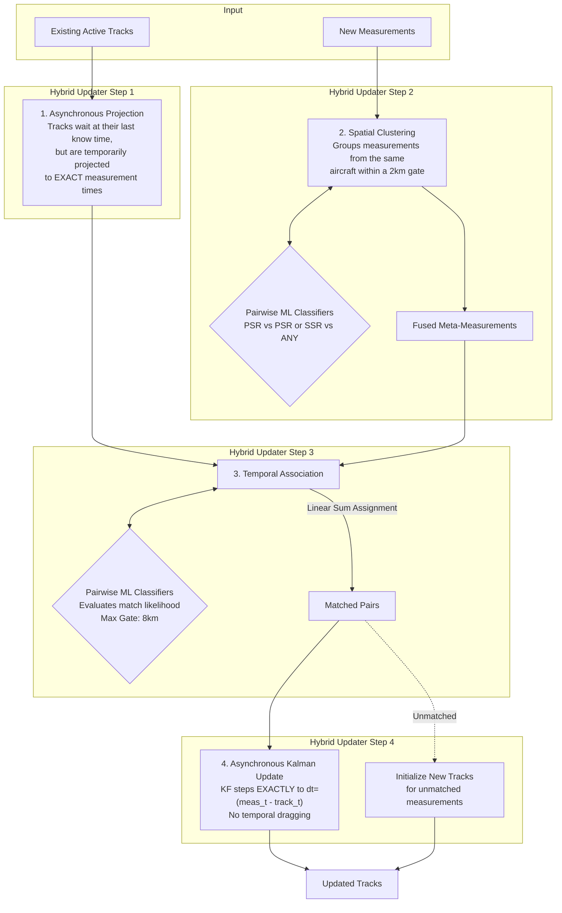
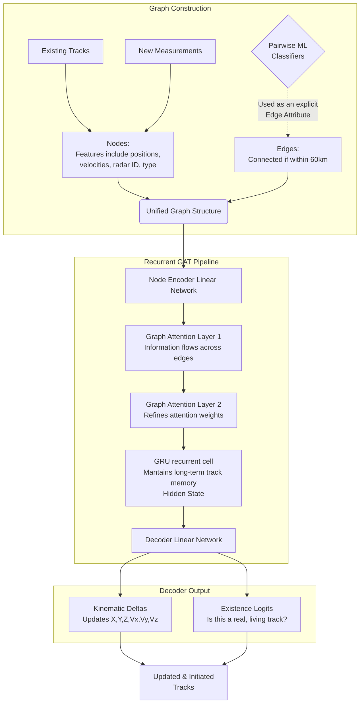

# AI Tracker Correlator Architecture

This document breaks down the architecture of the AI Tracker Correlator, explaining how raw radar measurements are processed into stable, persistent aircraft tracks.

It focuses specifically on the **Hybrid Tracker** and the **GNN Tracker**, showing how they fit into the overall pipeline and how they contrast in handling the complex multi-sensor environment.

## 1. High-Level Pipeline

Regardless of whether the system uses the Hybrid or GNN tracker, the overall stream of data goes through a unified pipeline defined in `src/pipeline.py`. The pipeline processes data in windowed chunks (e.g., every 1.0 or 2.0 seconds).

### The Common Steps:
1. **Windowing:** Since 5 radars are scanning asynchronously at different rates (5.5s to 9.0s), data is sliced into discrete time windows (e.g., 2 seconds). Measurements from any radar sweeping in this window are gathered.
2. **Clutter Filter:** A neural network classifier (`clutter_classifier.pt`) inspects each measurement. It immediately discards likely false alarms, reducing the burden on the tracker.
3. **State Updater:** The core engine of the system. It receives existing tracks and new measurements, and figure out how to merge them. This can be configured as `hybrid` or `gnn`.
4. **Track Manager:** Applies lifecycle rules. Tracks start as `tentative`, become `confirmed` if they get enough hits (`min_hits`), and are deleted if they aren't seen for too long (`max_age`).

---

## 2. Hybrid Tracker Architecture (`NewHybridUpdater`)

The **Hybrid Tracker** is the currently top-performing mode (MOTA ~0.79). It is called "Hybrid" because it blends traditional physics-based tracking (Kalman Filters) with Modern Machine Learning (Pairwise Classifiers for association).

The Hybrid approach takes a highly structured, step-by-step approach.

### Breakdown of the Hybrid Flow:
1. **Asynchronous Projection:** Instead of blindly predicting all established tracks to the end of the time-window (which causes "temporal dragging"), tracks remain precisely at the timestamp of their last recorded measurement. During Association, they are temporarily projected forward to exactly match an incoming measurement's time.
2. **Spatial Clustering:** In modern radars, a single aircraft might generate both a PSR (Primary) and an SSR (Secondary) return. The spatial clusterer groups measurements that are within 2km of each other. It uses **Machine Learning Pairwise Classifiers** to determine if two closely spaced measurements definitely belong to the same aircraft. Velocity and position are fused/averaged to create single "meta-measurements".
3. **Temporal Association:** The core data association problem: which measurement belongs to which existing track? We again use the **ML Pairwise Classifiers** (checking kinematics like distance, altitude, velocity vectors) to score every Track-Measurement pair within an 8km gate. The Hungarian algorithm (`linear_sum_assignment`) finds the optimal global pairing.
4. **Asynchronous Update (Continuous-Time Kalman Filter):** Matched tracks take a mathematical step forward using precisely `dt = meas_t - track_last_t`. The Kalman Filter optimally balances its continuous-time prediction against the new measurement via Process Noise ($Q$) and Measurement Noise ($R$). The updated track is stored natively at `meas_t`. 
5. **Initiation:** Any measurements left unmatched are assumed to be new aircraft and spawn a brand-new track with a highly uncertain initial Kalman covariance ($P$).

---

## 3. GNN Tracker Architecture (`RecurrentGATTrackerV3`)

The **Graph Neural Network (GNN) Tracker** attempts to solve the *entire tracking problem simultaneously in a single forward pass*. Instead of hand-written steps (clustering -> predicting -> associating -> updating), it treats all tracks and all measurements as nodes in a graph.

### Breakdown of the GNN Flow:
1. **Graph Construction (`build_full_input` & `build_gnn_edges`):**
   - **Nodes:** Every existing track is a node. Every new measurement is also a node.
   - **Edges:** Nodes are connected if they are close to each other geographically. 
   - **Edge Attributes:** Crucially, the same Pairwise ML Classifiers used in the Hybrid model are used here to score the edges, feeding the GNN explicit clues about what belongs together.
2. **Graph Attention (GATv2):** As information passes through the layers, the attention mechanism dynamically figures out how much a track should "care" about a measurement. It inherently performs association and clustering in weight-space.
3. **Recurrent Memory (GRU):** Instead of a Kalman Filter mathematically retaining covariance matrices, the GNN uses a Gated Recurrent Unit (GRU) to hold a hidden multi-dimensional memory state for each track. This hidden state carries over from frame to frame.
4. **Outputs:** The network directly predicts a state $\Delta$ to update the position/velocity of the track. It also outputs an "existence probability." If a measurement node receives a high existence probability, it is born as a new track. If an existing track node gets a low existence probability, it is killed.

## Advantages and Trade-offs

| Feature | Hybrid Tracker | GNN Tracker |
| :--- | :--- | :--- |
| **Philosophy** | Modular, physics-constrained, explicit rules. | End-to-end, data-driven, unified. |
| **Strengths** | - Very stable (physics boundaries). - Highly interpretable (can trace KF matrices). - Less reliant on massive perfectly clean training data. | - Could theoretically learn complex maneuvers physics can't model. - Handles dense ambiguity seamlessly. |
| **Weaknesses** | - Hardcoded thresholds (gates, clustering rules). - Struggle with highly non-linear maneuvers. | - A "black box" regarding why a track was dropped. - Very sensitive to training data shifts (thresholds shift). |
| **Current Performance** | **High** (MOTA: 0.82, Precision/Recall > 88%). The tuned physics rules work extremely well here. | **Training Dependent**. Requires significant data-alignment and confidence tuning to reach the baseline. |

---

## 4. Current Performance Metrics

Evaluated on a dense 120-second simulated streaming dataset with 5 asynchronous radars, the **Hybrid Tracker** currently achieves the following metrics natively:

| Metric | Score | Note |
| :--- | :--- | :--- |
| **MOTA** | `0.8211` | Multi-Object Tracking Accuracy (Overall tracking quality). |
| **MOTP** | `805.9m` | Multi-Object Tracking Precision (Distance error. Matches ~3σ radar noise). |
| **Precision** | `0.8892` | Rate of correct track predictions vs False Tracks. |
| **Recall** | `0.9380` | Rate of ground-truth tracks successfully maintained. |
| **F1** | `0.9129` | Harmonic mean of Precision and Recall. |
| **ID Switch** | `0` | Number of times an established track swapped identities. |

---

## 5. GNN Tracker: Performance and Failure Analysis

While the End-to-End GNN approach (RecurrentGATTrackerV3) showed theoretical promise on aligned batch datasets, its real-world performance on asynchronous streaming data falls drastically short of the physics-based Hybrid Tracker.

Evaluated on the exact same 120-second streaming scenario (`stream_radar_001.jsonl`), the **GNN Tracker** achieves:

| Metric | Score | Note |
| :--- | :--- | :--- |
| **MOTA** | `-0.7043` | Negative MOTA indicates the tracker outputs more false positives/errors than there are actual ground truth targets. |
| **MOTP** | `3240.4m` | Precision error is extremely high (over 3 kilometers). |
| **Precision** | `0.0049` | Essentially 0%. Almost all emitted tracks are false or heavily corrupted. |
| **Recall** | `0.0035` | Essentially 0%. It fundamentally fails to maintain continuous tracks. |

### Assessment: Why does the GNN fail?

1. **Handling Time and Sparsity:** The GNN expects to step uniformly. With radars scanning asynchronously (5.5s to 9s periods), a 2.0s evaluation window means most tracks receive *zero* new measurements in a given step. A Kalman Filter handles this seamlessly by coasting linearly. The GNN's recurrent GRU, however, struggles to maintain a stable hidden state without new input features, rapidly decaying its internal confidence.
2. **The "Existence Gate" Collapse:** Because the hidden state decays during sensor shadows, the linear decoder layer responsible for predicting the `existence` probability (is this track real?) quickly drops below the threshold. The GNN continuously kills legitimate tracks the moment they coast, leading to near-zero recall.
3. **Rigid Dimensionality vs. True Asynchrony:** As established by the Hybrid Tracker's success, accurate multi-radar processing requires exact, dynamic sub-window projection (`dt = meas_t - track_t`). The GNN forces all inputs into a static batch snapshot, inherently falling victim to "temporal dragging" and failing to learn strict kinematic extrapolation. Physics provides perfect linear extrapolation "for free"—asking an MLP decoder to learn it perfectly across arbitrary time-gaps is highly inefficient.
