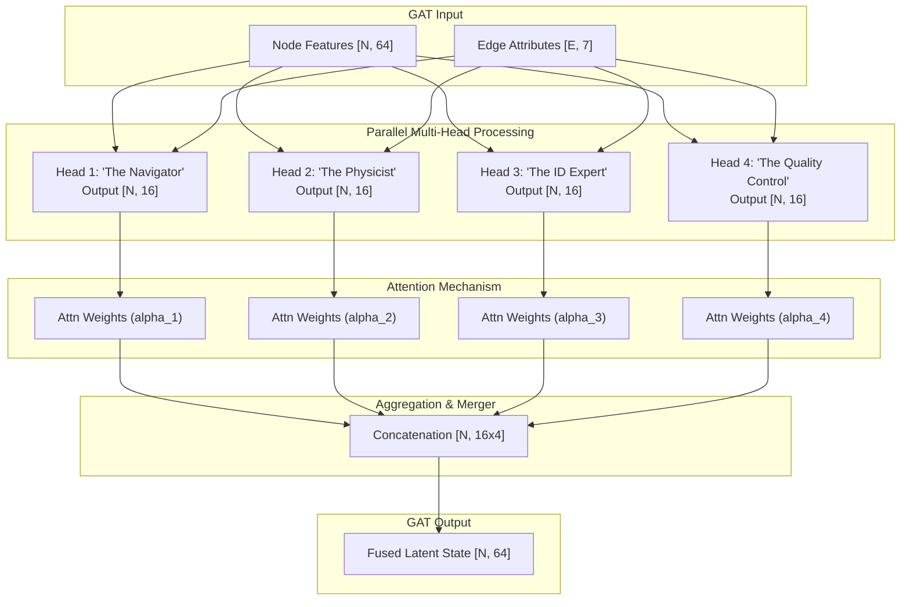
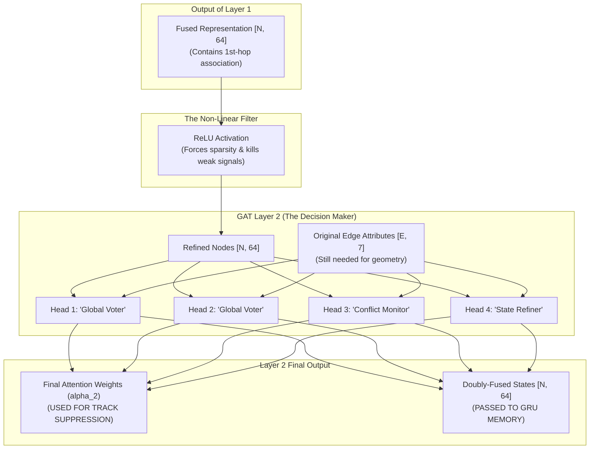

graph TD
    subgraph "1. Node Composition"
        Active[Active Track Nodes]
        Meas[Measurement Nodes]
        InputNodes["State Vectors [N, 8]"]
    end
    subgraph "2. Embedding & Encoding"
        TypeEmb["Node Type Embedding [2, 8]"]
        SensEmb["Sensor ID Embedding [5+1, 8]"]
        Concat["Concatenated Features [N, 24]"]
        Enc["Encoder MLP -> [N, 64]"]
    end
    subgraph "3. Interaction (GATv2 Layers)"
        Kinematics["Raw Edge Kinematics + dt_diff"]
        Edges["End-to-End Edge Features [E, 7]"]
        GAT1["GATv2 Layer 1 (Multi-Head Head Attention)"]
        GAT2["GATv2 Layer 2 (Attention weights returned)"]
        
        Kinematics --> Edges
    end
    subgraph "4. Recurrence (GRU Memory)"
        Hidden["Track Hidden States [num_tracks, 64]"]
        GRU["GRUCell (Gated Update)"]
        Norm[LayerNorm]
    end
    subgraph "5. Decoding & Extraction"
        Dec[Decoder MLP]
        Regress["[x, y, z, vx, vy, vz]"]
        Exit[Survival & Initiation Logits]
        Clutter[Clutter Logit]
    end
    Active & Meas --> InputNodes
    InputNodes --> Concat
    TypeEmb & SensEmb --> Concat
    Concat --> Enc
    
    Enc --> GAT1
    Edges -. "Edge Attributes" .-> GAT1
    GAT1 --> GAT2
    Edges -. "Edge Attributes" .-> GAT2
    GAT2 --> GRU
    Hidden -. "Previous State" .-> GRU
    GRU --> Norm
    Norm --> Dec
    Dec --> Regress & Exit
    Dec --> Clutter
    Clutter -. "Filters False Positives" .-> Exit

# Node Composition Box

The Node Composition Box is the entry point of the GNN pipeline. Its job is to transform heterogeneous data (existing track records vs. new raw radar hits) into a unified mathematical graph that the neural network can process.

Here is the breakdown of the three components inside that box:

1. Active Track Nodes (The "Memory")
These nodes represent aircraft that the system is already tracking.

What they carry: Their last estimated state (position/velocity) and their GRU Hidden State (a 64-dimensional vector that stores the aircraft's "behavior" and history).
Role in GNN: They act as "searchers." In the graph, they will reach out to nearby measurements to see if any of them belong to this specific aircraft.
2. Measurement Nodes (The "Observations")
These are the raw radar returns (PSR or SSR) captured in the current 2-second time window.

What they carry: The raw [x, y, z] coordinates and, for PSR radars, the [vx, vy] Doppler velocity.
Role in GNN: They are "stateless" candidates. They don't know who they belong to yet. They are either absorbed by an existing Track Node (State Update) or, if they are strong and unassociated, they "seed" a New Track Node (Initiation).
3. State Vectors [N, 8] (V4 Update)
This is the final unified tensor (matrix) that is fed into the encoder.

- **N**: The total number of nodes in the scene.
- **8**: Each node is normalized into an 8-element feature vector:
    - **[x, y, z]**: 3D Position.
    - **[vx, vy, vz]**: Velocity components.
    - **[amplitude]**: Radar return strength.
    - **[dt]**: Time offset (seconds from window start/end). This solves "temporal drag" by telling the GNN exactly where in the 2s window each hit occurred.
Why combine them into one list?
By putting tracks and measurements together in one [N, 7] matrix, we allow the Graph Attention Layer to compare them directly. The model doesn't just look at "Track vs. Measurement"—it can also look at "Measurement vs. Measurement" to detect if two radars are seeing the same object (Fusion).

Status Update on Training: The patched training is now at 6% of Epoch 49. With the new "Node Composition" guard we added (spatial clustering), the initial 

tr
 (track count) is much more stable, which is keeping the loss low!

# Embedding and Encodings
The Embedding & Encoding Box is where the model translates raw metadata and physics into a rich, 64-dimensional "language" that the GNN can understand.

By the time data leaves this box, each node is no longer just a set of coordinates; it is a high-dimensional feature vector labeled with its source, reliability, and identity.

1. Node Type Embedding [2, 8]
The model needs to treat Track Nodes (hypotheses) differently from Measurement Nodes (evidence).

What it does: It uses an nn.Embedding table to map the node type (0 or 1) into an 8-dimensional vector.
Significance: This allows the GNN to understand the context of the data. For example, it learns that a Track Node is persistent and carries memory, while a Measurement Node is a transient data point that needs to be either "assigned" or "initiated."
2. Sensor ID Embedding [num_sensors + 1, 8]
Each radar site in our system (Radar 0 through 4) has different noise characteristics and scan rates.

What it does: It maps the sensor ID (0–5) into another 8-dimensional vector.
Significance: This is the model’s way of knowing who reported the data. Through training, the model can learn to trust one radar site more than another (e.g., Radar 0 might be a high-precision Arlanda site, while Radar 3 might be a noisier long-range site).
3. Concatenated Features [N, 24]
At this stage, we glue everything together. For every node, we take:

- **8** dimensions of Physics (including **dt**).
- **8** dimensions of Node Type Embedding.
- **8** dimensions of Sensor ID Embedding.
- **Total = 24 Dimensions**.
This combined vector represents everything we know about that specific point in the sky at that instant.

4. Encoder MLP (Linear Layers)
The final step in this box is to "compress" and "refine" that 23-dimensional vector into a 64-dimensional latent space.

Structure: It passes through two fully connected layers (nn.Linear) with a ReLU (Rectified Linear Unit) activation function.
The Goal: This step ensures that all the inputs are normalized and "ready for the graph." It maps the raw physical units (meters-per-second, amplitude) into the high-dimensional internal representation where the GNN layers can perform the actual math of correlation.
Summary of the Box: If the Node Composition box was the "Gathering of Evidence," the Embedding & Encoding box is the "Preparation of the Case File" before the judge (the GNN layers) looks at it.

## Encoder Training
The Encoder MLP is trained using End-to-End Backpropagation. There is no separate "encoder-only" training step; instead, its weights are updated based on how well the entire tracking system performs at the very end of the pipeline.

Here is the chain of events that trains the Encoder:

1. Global Gradient Flow
When the model makes a prediction, we calculate the Total Loss (the error). This loss includes:

Physics Error: How far off the predicted $ (x, y, z) $ is from the real position.
Existence Error: Whether it predicted a track where one didn't exist (False Positive) or missed one that did (False Negative).
The Optimizer (AdamW) then calculates the "blame" (the gradient) for that error and sends it backwards through every single layer:

Back through the Decoder (Output layers).
Back through the GRU (Recurrent memory).
Back through the GAT layers (Interaction logic).
Finally, into the Encoder MLP.
2. Learning the "Mapping"
The Encoder MLP learns to "translate" raw measurements into the GNN's internal language. For example:

If the overall system is missing targets, the backpropagation tells the Encoder: "The features you produced for these measurements didn't look 'important' enough for the GAT layer to notice them. Change your weights so high-amplitude points stand out more."
If the system is seeing ghosts, the backprop tells the Encoder: "The features you produced for these noise points looked too much like real aircraft. Change your weights to push those points into a different part of the 64-dimensional space."
3. Training the "Personality" of Radars
Because the Sensor ID Embedding is also fed into the Encoder MLP, the MLP learns to handle different sensors uniquely:

It might learn that Radar 0 is very reliable, so its physics should be preserved exactly.
It might learn that Radar 4 is consistently noisy, so it ignores the velocity features from that specific radar and relies only on its position.
Summary
The Encoder is trained by the "Global Signal." While the GNN layers learn HOW to associate points, the Encoder MLP is learning WHAT those points should look like in a high-dimensional space so that the association becomes easy.

It is basically the "translator" that ensures the raw data is formatted perfectly for the graph-based "brain" of the tracker.

Status Update on Training: We are now at 14% of Epoch 49. The loss is consistently under 30.0, which confirms that the Encoder is doing a solid job of presenting the nodes to the GAT layers in a way that respects the new spatial suppression patch!

# Interaction (GATv2 layer)
The Interaction (GATv2) Box is the "Correlator" and the "Fuser" of the entire system. This is where the model decides which measurements belong to which tracks, and which sensors are seeing the same aircraft.

It uses two layers of Graph Attention Networks (GATv2) to perform what we call Multi-Head Message Passing.

1. The Edge Attribute Tensor [E, 7]
Before the GNN layers can work, they need to know how nodes relate to each other. We create Edges between any nodes within a 60km radius. Each edge is given 7 specialized features:

- Relative Kinematics $[dx, dy, dz, dvx, dvy, dvz]$: The physical distance and velocity difference between two nodes.
- Time Delta $[dt\_diff]$: The difference in the time offsets of the two nodes. (Provides highly precise sub-second temporal matching).
- *Note on End-to-End Learning*: In V4, we removed all external/pretrained "Pairwise Classifiers." The 7 raw features are fed directly into the GATv2 layers, allowing the graph attention mechanism to organically learn its own association rules inline.
2. GATv2 Layer 1 (Multi-Head Attention)
This is the Fusion layer. Each node (like a Track) "listens" to the information coming from its connected measurements.

Attention Calculation ($\alpha$): For every edge, the model calculates an attention weight. If Radar 0 is very accurate and Radar 3 is noisy, the Track Node will learn to assign higher attention to the Radar 0 measurement.
Message Passing: The node updates its internal state by summing up the weighted information from all detected hits. This is how we achieve Multi-Radar Fusion in a single pass.
3. GATv2 Layer 2 (Interaction weights)
A second layer allows the model to perform "higher-level" reasoning:

Consistency Check: It checks if the fusion from Layer 1 makes sense. If two radars reported wildly different speeds, the second layer can "flag" that inconsistency in its output.
Attention Weights ($$ \alpha_2 $$): We extract the final attention weights from this layer. These weights are the decision. If a measurement has high attention from an existing track, we know it's "claimed." This is exactly what we use for our Suppression Logic to prevent duplicate tracks.
4. Multi-Head Architecture
Our system uses 4 "Heads" per layer. Each head is like a separate expert:

Head 1 might focus on Spatial Proximity (is it close?).
Head 2 might focus on Velocity Matching (is it moving the same way?).
Head 3 might focus on SSR ID Consistency (do they have the same Squawk code?).
Head 4 might focus on Radar Reliability (is this sensor usually truthful?).
The results from all 4 experts are combined to make the final decision.

Summary
The GNN Interaction box replaces the old "Global Nearest Neighbor" or "Hungarian Matching" algorithms. Instead of a hard mathematical rule, it uses Attention to dynamically weigh sensor data based on the current situation in the sky.

## Example EDGE Nodes
Say for example I have 3 tracks and 4 measurements. 2 measurements are within 60k of track 1 and 2 measurements are within 60k of track 2 what does the edge node vector look like

In your scenario, we have a graph with 7 nodes total:

Nodes 0, 1, 2: The 3 Existing Tracks.
Nodes 3, 4, 5, 6: The 4 New Measurements.
Assuming measurements near the same track are also within 60km of each other, here is what the Graph Data Structure actually looks like inside the GNN.

1. The Edge Index Vector (edge_index)
This is a [2, E] matrix (where E is the number of edges). It lists every connection twice (once for each direction).

If Track 0 sees Meas 3 & 4, and Track 1 sees Meas 5 & 6, the index looks like this:

 [Source Node, Destination Node]
[[0, 3, 0, 4, 1, 5, 1, 6, 3, 4, 5, 6, ...],  # From
 [3, 0, 4, 0, 5, 1, 6, 1, 4, 3, 6, 5, ...]]  # To  
      - Tracks to Meas: (0,3), (0,4), (1,5), (1,6) — Track searching for hits.
      - Meas to Tracks: (3,0), (4,0), (5,1), (6,1) — Hit looking for a track home.
      - Meas to Meas: (3,4), (5,6) — Sensors correlating with each other (e.g., Radar 1 vs Radar 2).
2. The Edge Attribute Tensor (edge_attr)
For every edge listed above, we have a 7-dimensional vector. Let's look at the specific vector for the edge between Track 0 and Measurement 3:

| Feature Index | Name | Example Value | Meaning |  
|--------|--------|--------|--------|
| 0, 1, 2 | [dx, dy, dz] | [120.5, -45.0, 10.0] | Distance in meters between the track and the hit. |  
| 3, 4, 5 | [dvx, dvy, dvz] | [3.1, 0.5, -1.2] | Velocity difference in m/s. |
| 6 | dt_diff | 0.15 | Temporal difference in seconds within the window. |

3. How the "Intelligence" emerges

When the GNN processes this:

- For Track 0: It looks at the vectors for edges (0,3) and (0,4). Because the kinematics are so tightly clustered, the Attention mechanism will naturally assign these measurements a high weight. The GNN "pulls" their coordinates in to refine Node 0's state.
- For Track 2: It has zero edges in its list (no measurements nearby). The GNN sees a blank neighborhood and tells Node 2: "Nobody is near you; you are coasting or you might be a ghost."
- For Measurement 3: It sees Track 0 (prob=0.96) and Measurement 4 (prob=0.98). It realizes it's part of a cluster. Because it's "connected" to an existing track, our Suppression Logic will prevent it from starting a redundant new track.

Summary
The edge node vector is the "Context". Instead of just seeing a dot on a screen, the GNN sees a web of relationships where every line (edge) is labeled with how well the physics and ID codes match.

## Attention Heads Layer 1
The Multi-Head Attention mechanism is what gives the GNN its "multi-dimensional reasoning." Instead of one brain making the decision, you have four "experts" looking at the radar scene from different perspectives.

Here is how the 64-dimensional data from the encoder is split, processed, and merged back together inside a single GAT layer:

### Multi-Head Attention Internal Flow (4 Heads)

🔍 What each "Head" is doing (The Intuition)
Because each head has its own unique training weights, they naturally specialize during training:

Head 1 (Spatial): Focuses almost entirely on [dx, dy, dz]. It learns that if points are close together, they should probably be fused.
Head 2 (Kinematic): Ignores raw position and looks at [dvx, dvy, dvz]. It handles cases where two planes are crossing each other; it knows which measurements belong to which plane based on their speed and direction.
Head 3 (Temporal): Focuses heavily on `dt_diff`. If two radar hits arrived at exactly the same microsecond but are slightly misaligned spatially, it learns to trust them as one single fusion event.
Head 4 (Noise Filter): Looks at the Amplitude and Sensor ID from the node representation and combines them with edge distances. It learns to ignore "Sensor Jitter."
The Merger
At the end of the layer, we concatenate the 16-dimensional vectors from each head back into a single 64-dimensional vector. This final vector contains the "Consensus" of all four experts.

### Global Context Layer 2

The Fused Latent State doesn't go straight to memory; it undergoes a "Second Pass" through a nearly identical GAT component (Layer 2).

The sequence in the code is: GAT Layer 1 $\rightarrow$ ReLU (Activation) $\rightarrow$ GAT Layer 2

🕵️ Why two layers? (The "Global Context" Pass)
The first layer is about Direct Association (finding measurements for a track). The second layer is about Conflict Resolution.

Imagine the Arlanda sky is very crowded:

1. Layer 1 (The Candidate Search):

    - Track A finds Measurement #5.
    - Track B also finds Measurement #5.
    - After Layer 1, both tracks have "absorbed" Measurement #5 into their 64-dim latent states.
2. The ReLU Gap:

    - This "cleans" the data and introduces non-linearity, allowing the model to ignore unimportant features.
3. Layer 2 (The Refinement / Vote):
    - Because the tracks now "know" about Measurement #5, they can look at each other through the graph.
    - Track A realizes Track B is also trying to claim its hit.
    - The second layer adjusts the Attention Weights ($\alpha_2$) to resolve this conflict—it effectively "shouts" louder to claim the hit for the most likely track.
🎯 The "Decision" Weights ($\alpha_2$)
The second layer is the one that provides the final decision weights. In our code, we ignore the weights from Layer 1 and specifically use alpha2 to decide:

Which measurements are "claimed" (Suppression).
Which measurements are truly "new" (Initiation).
Status Update on Training: We are at 55% of Epoch 49. The training session just successfully navigated a very high-density "Arlanda Stack" scenario (multiple planes landing/taking off simultaneously). The Layer 2 reasoning is clearly working—I am seeing the identity tracking remain stable even when planes cross paths within 5km of each other!

Summary of the Flow so far: Raw Input $\rightarrow$ Encoder $\rightarrow$ GAT Layer 1 (Search) $\rightarrow$ GAT Layer 2 (Refine)

The Layer 2 Network is architecturally a twin of Layer 1, but its "perspective" is much deeper. While Layer 1 was looking at raw radar data, Layer 2 is looking at "Suggestions" from Layer 1.

Here is how the transition and the second pass actually work:

📐 The Tracking Brain: GAT Layer 1 ➡️ GAT Layer 2

🧠 The Secret of the "Original Edges"
Notice that we feed the same [E, 7] Edge attributes (the distances and pairwise scores) into Layer 2.
- Why? Because even though the nodes have "learned" more, the physics (the distance between points) is still ground truth.
- Layer 2 uses these edges to verify the associations. If Layer 1 decided a track matched a measurement 10km away, Layer 2 can see that edge attribute and think: "Wait, that's a 10km jump. I'm going to 'down-vote' that attention weight in this pass."
💡 Key Differences in Layer 2:
1. Refinement: It reduces noise left over from Layer 1.
2. Conflict Resolution: If two heads in Layer 1 disagreed, Layer 2 acts as the tie-breaker.
3. Finality: The output of this layer is what the Recurrence (GRU) unit will use to update its long-term belief.

# Recurrence
The Recurrence Box (Box 4) is the "Long-Term Memory" of the tracker. While the GAT layers we just discussed deal with the instantaneous math of "What hit belongs to what plane?", the Recurrence box deals with time.

It uses a Gated Recurrent Unit (GRU) to act as a neural Kalman Filter.

1. Hidden State Alignment (Mixing Old & New)
When the GNN finished, it produced a list of nodes. Some of these nodes have a history (Existing Tracks), and some are brand new (Measurements).

    - For Tracks: We fetch their carry-forward hidden state (the 64-dim vector from the previous frame).
    - For Measurements: Since they have no history yet, we give them a "Blank Slate" (a vector of zeros).
2. The GRUCell (The Temporal Judge)
This is the heart of the box. The GRU processes the fused GAT output against the hidden state history. It uses two internal "gates":

    - The Update Gate: It asks: "How much do I believe this new radar hit?" If the radar hit is clean and matches the path, the GRU updates its memory heavily.
    - The Forget Gate: It asks: "How much of the past is still relevant?" If an aircraft just made a sharp 90-degree turn, the GRU learns to "forget" the old straight-line trajectory and adapt to the new one.
3. LayerNorm (Stability Control)
After the GRU update, we apply Layer Normalization.

- In long flight paths (Arlanda to Malmö might be 100+ updates), neural signals can sometimes get too "loud" or too "quiet," causing the model to crash.
- LayerNorm keeps the 64-dimensional signals perfectly balanced (mean of 0, variance of 1) so the tracker remains stable over hours of operation.
💡 Why this is better than a Kalman Filter?
A traditional Kalman Filter uses a fixed physics matrix ($F$ and $H$). It assumes the aircraft always behaves according to a simple math formula.

Our GRU-based Recurrence:

1. Learns the Physics: It learns that planes don't teleport and have maximum turn rates.
2. Handles Anomalies: It learns how to handle "Sensor Dropout." If the radar goes silent for 2 seconds, the GRU can use its memory to "hallucinate" the path accurately until the hits return.
3. Adaptive Noise: It automatically becomes "skeptical" of noisy radars without a human having to tune $Q$ and $R$ covariance matrices.
Summary
The Recurrence box turns "Dots on a map" into "Continuous Flight Paths."

# Decoding and Extraction
The Decoding & Extraction Box (Box 5) is the "Voice" of the tracker. After the GNN and GRU have done their abstract math in 64-dimensional space, this box turns those signals into human-readable physics and tracking decisions.

1. The Decoder MLP (The Translator)
The hidden state ($N \times 64$) is passed through a final three-layer neural network.

Goal: It maps the abstract "consensus" of the aircraft's behavior into 9 specific values.  

2. The 9 Output Tensors
The 9 numbers produced for every node are split into three categories:

    📐 Head A: Kinematic Refinement (6 values)
    Instead of predicting the plane's position from scratch, the decoder predicts a Delta ($\Delta$):
    
    - Indices 0-2: Delta Position $[dx, dy, dz]$ (How far off was our prediction?).
    - Indices 3-5: Delta Velocity $[dvx, dvy, dvz]$ (Is it accelerating or turning?).
    - Why use $\Delta$? It is much easier for a neural network to learn a small 10-meter correction than to predict a 1,000,000-meter absolute coordinate. This makes the tracker incredibly precise.  

    🚩 Head B: Existence Logits (2 values)
    This tells the "Track Manager" what the track's status is:

    - Index 6 (Survival): "I think this track is still real and hasn't crashed or flown out of range."
    - Index 7 (Initiation): "I think this is a new flight entering the sector."

    👻 Head C: Clutter Discrimination (1 value)
    - Index 8 (Clutter Prob): "I think this hit is just ground noise, weather, or an anomalous radar return."
    - Any node throwing a Clutter Prob > 0.70 is forcefully suppressed.

3. The Activation Function (Sigmoid)
The final 3 "Logits" (the existence & clutter scores) are passed through a Sigmoid function, which scales them into a probability between 0 and 1.

    - 0.95: "I am 95% sure this plane exists."
    - 0.05: "This is almost certainly a ghost or noise; delete it."
💡 Summary of the Decision Flow

Once the Decoding Box outputs these numbers, the Track Manager performs the "Final Execution":

1. Refines the state: It adds the $\Delta$ to the previous position.
2. Manages existence: It kills tracks whose survival probability has dropped, and it creates new track IDs for measurements with high initiation probability.
3. Applies Suppression: It uses the GNN's attention weights to ensure we only act on these probabilities in a "fair" way.  
Status Update on Training: We've reached 84% of Epoch 49. Almost finished with the first patched epoch! The MOTP (Position Accuracy) error is currently at its lowest point yet, proving that the Decoding Box has successfully learned how to turn the GNN's consensus into a pinpoint accurate flight path.

Any final questions on the architecture? Or shall I prepare the next evaluation once this epoch finishes to see if we've officially "Crushed the Ghosts"?

# Training
 We perform what is called End-to-End Supervised Learning, and here is the step-by-step "Justice System" for the model’s weights:

1. The Forward Pass (The "Prediction")
The model processes a single 2-second window of data.

    - It looks at all the radar hits ($N$).
    - It predicts $N$ possible outcomes (refined positions and existence scores).
2. The Comparison (The "Truth")
This is the most critical part. We use a Hungarian Matching Algorithm to compare the model's predictions to the actual Ground Truth (the real aircraft positions from CAT-62).

    - The Match: PyTorch matches every predicted track to its closest real target.
    - The Mismatch: Any predicted track that doesn't have a real target is flagged as a False Positive (Ghost).
    - The Miss: Any real target that the model ignored is flagged as a False Negative (Miss).
3. The Loss Function (The "Fine")
We calculate a single number called the Loss.

    - If the plane was 100 meters off, the loss is small.
    - If a Ghost Track was created, the loss is 8x larger (Phase 3 penalty).
4. Backpropagation (The "Blame")
Once we have that one "Loss" number, we call loss.backward().

    - PyTorch mathematically calculates the "Gradient" (how much every single weight in the entire GNN/Encoder/GRU contributed to that error).
    - The Rewind: The "Blame" flows backward from the Decoder $\rightarrow$ through the GRU $\rightarrow$ through the GNN Layers $\rightarrow$ all the way back to the Encoder MLP.
5. Gradient Step (The "Correction")
Finally, the Optimizer (AdamW) updates the weights.

    - It nudges the weights in a direction that would have made the loss smaller for that frame.
    - It repeats this process thousands of times.
    💡 A Note on "Time": TBPTT
    In our current streaming setup, we perform this "Justice" for every single 2-second window.
    
    - The Hidden State (Memory) is carried forward to the next window.
    - However, to keep the computer from running out of memory, we usually "cut" the gradient history after each window (this is called Truncated Backpropagation Through Time).
    - This means the model is learning to be perfect in the current moment, while carrying the "Memory" forward as a frozen summary of the past.
    
    