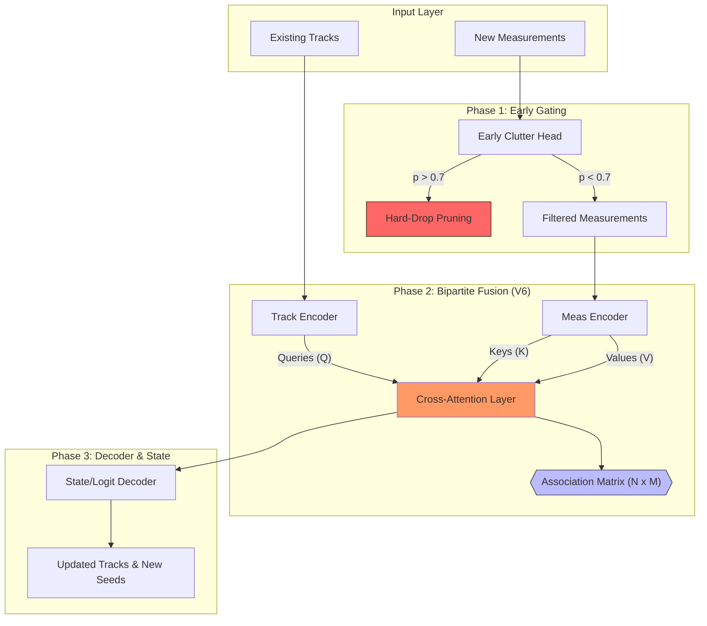

V6: Bipartite Cross-Attention Tracker
The core innovation of V6 is the Query-Key-Value (QKV) separation between tracks and measurements. This prevents "Measurement-to-Measurement" noise reinforcement—a primary cause of ghost tracks.

1. The Mathematical Model
Let $H_T \in \mathbb{R}^{N_{tracks} \times D}$ be the hidden states of existing tracks, and $H_M \in \mathbb{R}^{N_{meas} \times D}$ be the encoded features of incoming measurements (after early clutter gating).

Early Clutter Head (Phase 1): $$p_{clutter} = \sigma(MLP_{clutter}(H_M))$$ We drop measurements where $p_{clutter} > \tau_{hard_drop}$.

Structural Cross-Attention (Bipartite): We treat Tracks as Queries ($Q$) and Measurements as Keys ($K$) and Values ($V$): $$Q = H_T W_Q, \quad K = H_M W_K, \quad V = H_M W_V$$ The association matrix $A$ is computed as: $$A = \text{Softmax}\left(\frac{Q K^T}{\sqrt{d_k}} \right)$$ Note: $A$ is strictly $N_{tracks} \times N_{meas}$. It cannot form edges between measurements, forcing the model to solve the association problem.

The Information Update: The track hidden states are updated via the weighted sum of measurement information: $$H'_T = H_T + \text{MultiHead}(Q, K, V)$$

2. Architectural Diagram

