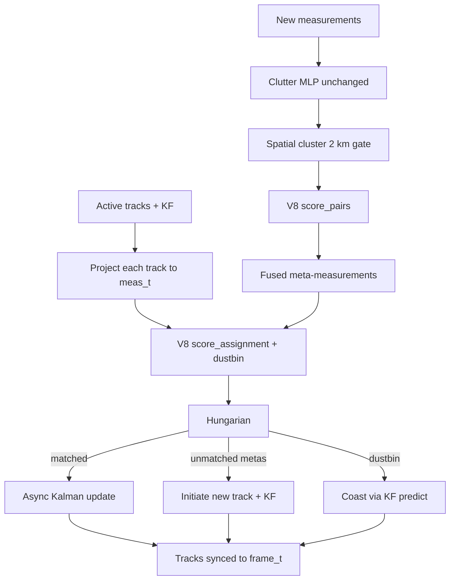

# V8 Design: Transformer Associator + Hybrid KF

**Status:** design only (not implemented)
**Date:** 2026-08-14
**Depends on:** `NewHybridUpdater` (`src/updater.py`), `SimpleKalmanFilter`, pairwise feature helpers
**Supersedes for research:** V7 pure transformer tracker (`artifacts/design_v7_transformer.md`)
**Does not replace:** Hybrid-MLP as the default operational path

## Goal

Use a small transformer **only as a set associator**. Keep Hybrid's async Kalman filter, Hungarian assignment, spatial gates, clutter filter, and M/N track manager.

V7 asked one network to associate, initiate, coast, and estimate state from 2 s windows. Holdout MOTA stayed negative (false-track flood). V8 does not retry that. The net scores gated pairs; physics owns time and kinematics.

**Rule:** the net scores pairs. The Kalman filter owns state. Hungarian owns uniqueness. Hybrid's time model stays.

## Why this vs V7

| Job | Hybrid (current best) | V7 Transformer | V8 |
|-----|------------------------|----------------|-----|
| Same-aircraft PSR+SSR fusion | 2 km gate + pairwise MLPs + connected components | Soft meas self-attn | Same 2 km gate; V8 `score_pairs` |
| Track↔plot assignment | Hungarian on learned pairwise costs | Soft MHA, no 1-to-1 | Hungarian on V8 costs + dustbin |
| Identity (Mode 3A/S) | First-class SSR features | Not in the token | Token embeds + `rel_ij` match flags |
| Time | Async KF: `dt = meas_t − track_t` | 2 s snapshot + `dt_offset` | Unchanged Hybrid projection |
| Motion | Continuous-time CV Kalman | Learned residual Δs | Unchanged KF |
| Clutter | Dedicated MLP | Head exists, loss unused | Unchanged clutter module |
| Initiation | Unmatched metas, M/N hits | Any meas with `P(exist) > init` | Unchanged unmatched-meta init |
| Coasting | KF predict through shadows | GRU + existence logit | Unchanged KF coast |

Published reference numbers (same streaming problem):

| | Hybrid | V6 GNN | V7 (best / default) |
|---|---:|---:|---:|
| MOTA | **0.82 – 0.925** | −0.70 | −1.09 / −3.03 |
| MOTP | **~806 m** | 3240 m | 3539 / 3261 m |
| Precision | **0.89 – 0.999** | 0.005 | 0.049 / 0.105 |
| Recall | **0.93 – 0.94** | 0.004 | 0.059 / 0.374 |
| ID switches | **0** | high | 29 / 546 |

V8 ships only if it holds Hybrid's MOTA / zero ID switches and does not lose precision. The expected win is recall in crossings and SSR dropouts (joint scoring).

## What does not change

Keep the current Hybrid pipeline:

```
Clutter MLP
    → spatial cluster (2 km gate)
    → temporal associate (8 km, track projected to meas_t)
    → Hungarian
    → async CV Kalman  (dt = meas_t − track_t)
    → M/N track manager  (min_hits=3, max_age≈10)
```

Unchanged modules:

- `src/kalman_filter.py` — `SimpleKalmanFilter`
- `src/pipeline.py` — clutter, promotion, deletion, track cap
- Gates: **2 km** cluster, **8 km** temporal
- Identity propagation (`mode_3a` / `mode_s` onto the track)
- Final sync of every KF to `frame_t`

**Removed from V7's job list:** residual Δs, existence/init heads, GRU memory, `manage_tracks`, windowed residual training.

## What V8 replaces

Only the two MLP scoring calls inside `NewHybridUpdater`:

| Call site | Today | V8 |
|-----------|--------|-----|
| `_spatial_cluster` | `PairwiseAssociationClassifier` on PSR-PSR (6-d) / SSR-ANY (4-d) | same gates, V8 `score_pairs` |
| `_associate` | same MLPs → cost `1−p` → Hungarian | V8 `score_assignment` → cost + dustbin → Hungarian |

Do **not** add `V8HybridUpdater`. Do **not** register V8 in `get_model_suite`. V8 is a pairwise backend, not a tracker version.

### Config

```python
# src/config_schemas.py — extend PairwiseConfig
class PairwiseConfig(BaseModel):
    backend: Literal["mlp", "transformer", "ensemble"] = "mlp"
    v8_model_path: Optional[Path] = Path("checkpoints/model_v8_assoc.pt")
    # existing mlp paths / thresholds stay
```

| `backend` | Behavior |
|-----------|----------|
| `mlp` | Current Hybrid (default, operational) |
| `transformer` | V8 only |
| `ensemble` | `p = 0.5 * p_mlp + 0.5 * p_v8` while proving the net |

CLI: `--mode hybrid --assoc transformer`. Default remains Hybrid-MLP.

## Architecture

SuperGlue-style matcher, not a DETR tracker.

```
                    ┌─ Track tokens  ── self-attn (2×) ─┐
time-aligned inputs ┤                                     ├─ pairwise score head
                    └─ Meas / meta tokens ─ self-attn ──┘         │
                                                                   ▼
                                              S[i,j] = MLP([h_i ; h_j ; rel_ij])
                                              dustbin[i] = MLP(h_i)
                                                                   │
                                              Hungarian on  [S | dustbin]
```

Optional later: one cross-attn block after self-attn. **v1 does not need it.** Explicit `rel_ij` already carries the geometry.



### Token (per track or plot)

Normalize before the Linear. Do not feed raw meters.

| Field | Scale | Notes |
|-------|--------|-------|
| `x,y,z` | `/ 1e5` | same as current pairwise |
| `vx,vy,vz` | `/ 1e3`, 0 if missing | + `has_vx` / `has_vy` / `has_vz` flags |
| `amplitude` | `/ 100`, 0 if missing | + `has_amp` |
| `role` | embed {track, meas} | |
| `meas_type` | embed {PSR, SSR} | tracks: SSR if they carry Mode 3A |
| `sensor_id` | embed 0–8 | tracks: dummy id |
| `mode_3a` | embed 12-bit squawk (0–4095), 0 = none | cue V7 dropped |
| `mode_s` | hash → 1024 buckets | + `has_mode_s` |
| `age`, `hits` | tracks only, clipped | 0 on measurements |
| `dt` | seconds, track already projected | 0 inside a cluster frame |

Capacity: hidden 64, 4 heads, 2 encoder layers, GELU, pre-norm, dropout 0.1. **No GRU.** Roughly 150–250k params.

### Relative pair features `rel_ij`

Always concatenated into the score head. Reuse and extend `src/pairwise_features.py`:

```
dx, dy, dz, dist/1e5,
dv_mag/1e3, cos_vel,
d_az, d_el,
dt,
mode_3a_match ∈ {+1, 0, −1},
mode_s_match  ∈ {+1, 0, −1},
same_sensor   ∈ {0, 1}
```

The transformer sees *context* (nearby tracks, co-located PSR/SSR). The MLP head still sees the physics features Hybrid already uses. That is the inductive bias V7 promised and never built.

### Dustbin

Every track (and, for clustering leftovers, every unmatched plot) gets an unmatched score. Softmax over competitors is **not** required at inference. Hungarian gets an extra column:

```python
cost[i, j]     = 1 - sigmoid(S[i, j])
cost[i, dust]  = 1 - sigmoid(dustbin[i])
row, col = linear_sum_assignment(cost)
keep if col[k] != dust and cost < 1 - tau
```

A coasting track in a radar shadow can choose dustbin. That column is what V7's forced-nearest-neighbor mask destroyed.

### Two call signatures (same weights)

```python
class AssociationTransformerV8(nn.Module):
    def score_pairs(self, left, right, pair_index) -> Tensor:
        """(P,) logits for gated pairs. Used by _spatial_cluster."""

    def score_assignment(self, tracks, metas) -> tuple[Tensor, Tensor]:
        """S: (T, M) logits, dustbin: (T,) logits. Used by _associate."""
```

Clustering stays local (2 km, usually tiny cliques). Association is the set problem (tens of tracks × tens of metas). One encoder, two heads sharing `h`.

## Time: Hybrid already solved it

`_associate` already builds a time-projected track dict before scoring:

```python
dt = m["t"] - t.get("kf_t", m["t"])
if dt > 0:
    tmp_t["x"] += t["vx"] * dt  # y, z likewise
# V8 scores (tmp_t, m) — kinematics are contemporaneous
```

V8 **must consume that projected dict**, not the raw KF state. The net never sees a 5–9 s gap as a position error. The process model stays in `SimpleKalmanFilter.predict(dt)`.

Hard gates stay in front of the net. V8 never scores a 50 km pair. That was V7's `max_assoc_m=50_000` mistake.

## Updater wiring

```python
# NewHybridUpdater.__init__
backend = getattr(config.pairwise, "backend", "mlp")
if backend in ("transformer", "ensemble"):
    self.v8 = AssociationTransformerV8()
    state = torch.load(config.pairwise.v8_model_path, map_location=self.device, weights_only=True)
    self.v8.load_state_dict(state)
    self.v8.eval()
else:
    self.v8 = None
# always load existing MLPs so ensemble / fallback works
```

`_spatial_cluster` — same pair enumeration, swap the logit source:

```python
if self.v8 is not None and backend != "mlp":
    logits = self.v8.score_pairs(measurements, measurements, gated_pairs)
    probs = torch.sigmoid(logits)
else:
    # existing batched MLP path
if backend == "ensemble":
    probs = 0.5 * probs_mlp + 0.5 * probs_v8
# adj[i, j] = 1 if p > 0.5   (keep current threshold)
```

`_associate` — same 8 km + time-project, then:

```python
S, dust = self.v8.score_assignment(projected_tracks, meta)
cost = np.ones((T, M + 1))
cost[:, :M] = 1.0 - sigmoid(S)
cost[:,  M] = 1.0 - sigmoid(dust)
row, col = linear_sum_assignment(cost)
valid = (col < M) & (cost[row, col] < 1.0 - tau)
```

Unmatched metas still initiate exactly as they do now. The KF update path is untouched.

## Training

This is **not** `train_streaming_v7`. Supervised matching, same label source as `scripts/train_hetero_pairwise.py`: `track_id` equality. No residual loss, no existence logit, no Hungarian-on-state.

### Samples

From any JSONL Hybrid already runs (`sim_hetero_001`, `stream_radar_001`, Sweden streams):

1. Slice a window (1–2 s) of plots.
2. **Cluster task:** all gated pairs inside the window. Label `1` if same `track_id` and id ≠ −1.
3. **Assign task:** fake "tracks" = last plot (or GT state) of each live id, time-projected to each candidate plot. Label a `(track, meas)` pair `1` if ids match and dist < 8 km. Tracks with no true plot in-gate get dustbin `1`.

Clutter (`track_id == -1`) is always a negative / dustbin target.

Split by **track id** (seed 42, 80/20) so holdout matches the V7 eval protocol.

### Loss

```
L =  focal_BCE(S[pos], 1)                 # true pairs
  +  focal_BCE(S[neg], 0)                 # gated non-matches, downsampled
  +  focal_BCE(dust[unmatched], 1)
  +  focal_BCE(dust[matched], 0)
  +  0.1 * entropy(row-softmax(S|dust))   # peaked, optional
```

No MSE-to-logit-4.0. No cardinality-on-track-count. Pos weight from class balance, same trick as the current pairwise trainer.

### Loop

```
uv run python -m src.train_associator_v8 \
  --data data/sim_hetero_001.jsonl \
  --epochs 30 \
  --out checkpoints/model_v8_assoc.pt
```

AdamW `1e-3`, batch of 8–16 windows (set context), not 512 independent pairs only.

Curriculum if needed: freeze encoder, train score head as a pairwise MLP on `rel_ij` only (should match current pairwise F1), then unfreeze self-attn.

## Forbidden (how V7 died)

Treat these as hard constraints.

1. Predict `Δx…Δvz` or existence.
2. Carry GRU / hidden state across windows.
3. Soft-suppress births with `sum(α)`.
4. Attend outside the Hybrid gates.
5. Eat raw meters with no `rel_ij`.
6. Drop Mode 3A/S.
7. Replace Hungarian with attention argmax.
8. Train on "are you near a GT after the fact."

## Files (when implementing)

| File | Role |
|------|------|
| `src/model_v8_associator.py` | `AssociationTransformerV8` + token / `rel_ij` builders |
| `src/train_associator_v8.py` | windowed matching trainer |
| `scripts/eval_v8_hybrid.py` | thin wrapper: `Pipeline(hybrid)` + `backend=transformer` |
| `artifacts/design_v8.md` | this spec |
| `src/updater.py` | ~40 lines: scorer dispatch in cluster + associate |
| `src/config_schemas.py` | `pairwise.backend`, `v8_model_path` |
| `run_cli.py` | `--assoc {mlp,transformer,ensemble}` |

No `src/model_v8.py` GAT alias. No factory key `v8`.

## Eval — beat Hybrid on the same contract

```
uv run run_cli.py --mode hybrid --assoc mlp         --data data/stream_radar_001.jsonl
uv run run_cli.py --mode hybrid --assoc transformer --data data/stream_radar_001.jsonl
```

| Metric | Hybrid-MLP (bar) | V8 ships if |
|--------|----------------:|-------------|
| MOTA | 0.82 / 0.925 | **≥ Hybrid** |
| MOTP | ~806 m | ≤ 900 m |
| Precision | 0.89–0.999 | ≥ 0.88 |
| Recall | 0.93–0.94 | **≥ Hybrid** (the only place V8 should win) |
| ID switches | 0 | **0** |

If ID switches go above 0, dustbin / Hungarian wiring is wrong — stop and fix, do not train more.

Ablations (one at a time):

1. `rel_ij` only, no self-attn (should ≈ MLP)
2. + self-attn
3. + identity embeds
4. + dustbin column
5. ensemble vs pure V8

Expected: (1) ties Hybrid; (3)+(4) recover recall in crossings and SSR dropouts. If (2) without (3) does nothing, set context is not the bottleneck — identity is.

Also run Sweden holdout. Hybrid was tuned on sim; V8 only earns its keep if it generalizes there without retuning gates.

## Implementation order

1. `AssociationTransformerV8` + `score_pairs` only, MLP-compatible logits.
2. Wire `backend=transformer` into `_spatial_cluster` and `_associate` (no dustbin yet). Confirm MOTA ≈ Hybrid on `stream_radar_001`.
3. Train on `track_id` pairs. Recheck. If this regresses, the token / normalization is wrong.
4. Add dustbin column to Hungarian.
5. Add self-attn; ablate identity on/off.
6. Sweden holdout. Ship only if step 2 never got worse and recall goes up.

Step 2 is the kill-switch. If a randomly-initialized V8 with `rel_ij` cannot approximate the current MLPs, the drop-in is not actually a drop-in.

## Non-goals

- Replacing Hybrid as the default CLI path.
- End-to-end residual tracking (V7).
- Learned continuous-time filter / KalmanNet.
- Production hybrid handoff until Sweden holdout matches or beats Hybrid-MLP.
