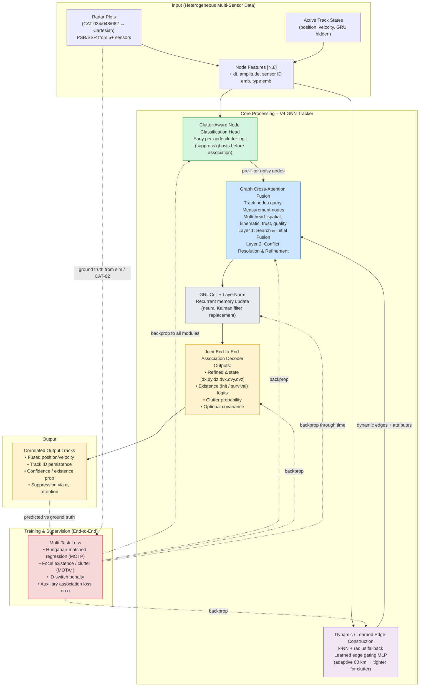

Here is a unified Mermaid diagram that merges the strengths of the two previous views into a single, coherent architecture representation for **V4 GNN AI Correlator Tracker**.

It combines:
- clear modular blocks (Input → Core Processing → Output + Training)
- sequential/data flow arrows showing the forward pass
- feedback/training loops
- emphasis on the key upgrades: clutter-aware early filtering, bipartite/cross-attention style fusion, dynamic edges, joint end-to-end association, and ID-aware supervision

### Quick Legend / Reading Guide
- **Left-to-right flow** = forward inference pass (2-second radar window)
- **Green block** = early clutter rejection (biggest expected precision boost)
- **Purple block** = replaces static 60 km edges (reduces clutter flooding)
- **Blue block** = core upgrade: cross-attention between track queries and measurement candidates (better correlation than self-attention on flat graph)
- **Orange block** = unified output head (replaces separate existence + regression logic)
- **Gray block** = temporal memory continuity
- **Red dashed feedback** = end-to-end training signal (Hungarian matching + new auxiliary terms)
- Colors help quickly distinguish the new V4 components from the legacy-inspired parts

