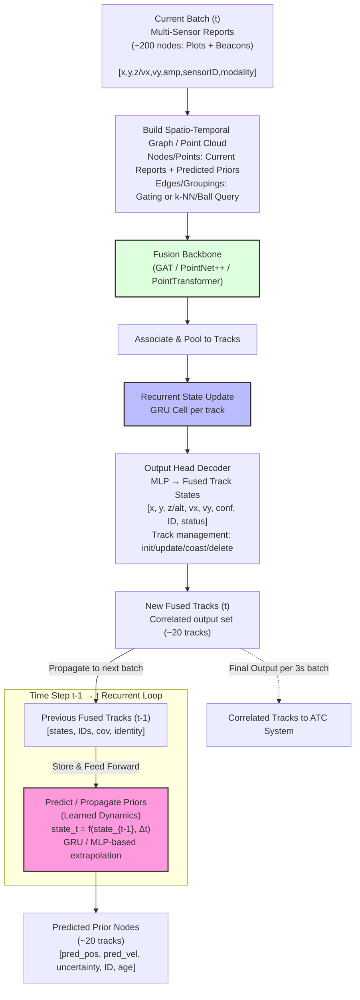

# Research Proposal: Feasibility of a Fully Learned Recurrent Graph Neural Network for End-to-End Multi-Sensor Radar Tracking and Fusion

## Abstract

This research proposes an innovative architecture for a single AI/ML-based tracker that processes multi-sensor radar inputs (Asterix CAT 034/048/062 messages) to produce a correlated set of output tracks, eliminating the need for separate physics-based trackers per radar and a downstream correlator. The core innovation is a **fully learned recurrence** mechanism integrated into a Graph Neural Network (GNN), enabling end-to-end learning of temporal dependencies, data association, and fusion without relying on hybrid physics models like Kalman filters. We outline the theoretical foundations for multiple candidate backbones suited to radar point-cloud-like data, and detail a supervised training and evaluation approach using simulated and real radar data. Feasibility is assessed through architectural comparisons, pseudocode, and performance metrics, aiming to identify the optimal model for improved robustness in cluttered environments and real-time deployment for air traffic control scenarios.

## Introduction and Background

Current radar tracking systems employ a per-sensor physics-based tracker (e.g., Kalman or alpha-beta filters) to process decoded Asterix messages (plots from CAT 048 with range, azimuth, amplitude, Doppler speeds; beacons with flight level and identity). These trackers handle plot-to-track association, clutter rejection, and track initiation. Outputs are then fused in a correlator to resolve multi-sensor ambiguities and produce correlated tracks (one per aircraft, with best-estimated position/velocity).

This multi-stage approach is interpretable but rigid, struggling with non-linear dynamics, sensor biases, and dense clutter. AI/ML offers a pathway to a **single unified tracker** that ingests raw multi-sensor reports and directly outputs fused tracks. This proposal evaluates multiple deep learning backbones for spatial fusion combined with learned recurrence, to determine the most effective architecture for end-to-end multi-sensor correlation.

### Research Questions
- Can a fully learned recurrent model achieve comparable or superior tracking accuracy (e.g., Multi-Object Tracking Accuracy (MOTA)/Multi-Object Tracking Precision (MOTP)) to physics-based systems?
- Which deep learning backbone (graph attention, hierarchical point abstraction, or positional transformer) best enables end-to-end training for multi-sensor radar fusion in 3-second batches?
- Through comparative evaluation of candidate architectures, what is the optimal design for robust data association, clutter rejection, and temporal continuity?
- What is the scalability of the selected architecture in dense radar environments and high-traffic scenarios (e.g., terminal areas with 500+ aircraft and heavy multi-sensor overlaps with 20+ radars)?

## Theoretical Foundations

Radar reports per batch form a sparse, unordered set of points in 3D Cartesian space with associated features (velocity, amplitude, sensor/modality). Three candidate backbones are considered, each with strong theoretical grounding for processing such data.

### Graph Attention Network (GAT)

GAT applies self-attention over explicitly connected neighbors, enabling dynamic weighting of reports during fusion.

Core update:
$$
h_i^{(l+1)} = \alpha_{ii} \, W h_i^{(l)} + \sum_{j \in \mathcal{N}(i)} \alpha_{ij} \, W h_j^{(l)}
$$

Attention coefficients:
$$
\alpha_{ij} = \frac{\exp(\text{LeakyReLU}(a^T [W h_i^{(l)} \| W h_j^{(l)}]))}{\sum_{k \in \mathcal{N}(i) \cup \{i\}} \exp(\text{LeakyReLU}(a^T [W h_i^{(l)} \| W h_k^{(l)}]))}
$$

Suitable for radar: Explicit gating creates sparse graphs; attention learns to prioritize high-confidence or modality-aligned reports.

### PointNet++

PointNet++ uses hierarchical set abstraction: farthest point sampling selects centroids, followed by multi-scale/multi-resolution grouping and mini-PointNet layers to extract local features progressively.

Theoretical basis: Permutation-invariant set learning with multi-scale context captures local aircraft clusters (multi-sensor reports) while building global understanding for clutter rejection and new track initiation.

Ideal for sparse radar points: Handles variable density and noise without requiring predefined edges.

### PointTransformer

PointTransformer applies local self-attention with explicit positional encodings on relative coordinates, enabling relation-aware feature transformation in point clouds.

Key computations (for node i and neighbors j ∈ 𝒩(i) ∪ {i}):

**Positional Encoding** (δ captures geometric relations):
$$
\delta_{i,j} = h_\Theta (\mathbf{p}_i - \mathbf{p}_j)
$$

**Attention Weights** (scalar attention on feature + positional differences):
$$
\alpha_{i,j} = \text{softmax}_j \left( \gamma_\Theta (\mathbf{W}_1 \mathbf{x}_i - \mathbf{W}_2 \mathbf{x}_j + \delta_{i,j}) \right)
$$

**Node Update** (weighted aggregation with positional bias):
$$
\mathbf{x}'_i = \sum_{j \in \mathcal{N}(i) \cup \{i\}} \alpha_{i,j} \left( \mathbf{W}_3 \mathbf{x}_j + \delta_{i,j} \right)
$$

Here, \( h_\Theta \), \( \gamma_\Theta \), \( \mathbf{W}_1 \), \( \mathbf{W}_2 \), \( \mathbf{W}_3 \) are learnable MLPs; \( \mathbf{p} \) are 3D positions.

Strong fit for multi-sensor radar fusion: Relative positional encodings learn fine-grained alignments (e.g., systematic offsets/biases across radars), while attention focuses on relevant reports for association and clutter suppression in overlapping coverage.

### Fully Learned Recurrence (Common to All Variants)

All candidates share GRU-based recurrence for temporal propagation:

Key state evolution:
$$
\hat{s}_t = g(s_{t-1}, \Delta t)
$$

GRU gates (pooled features as $ x_t $):
- Update gate ($ z_t $): Controls carry-forward vs. new evidence.
  $$
  z_t = \sigma(W_z \cdot [h_{t-1}, x_t] + b_z)
  $$
- Reset gate ($ r_t $): Forgets prior state for maneuvers.
  $$
  r_t = \sigma(W_r \cdot [h_{t-1}, x_t] + b_r)
  $$
- Candidate state ($ \tilde{h}_t $):
  $$
  \tilde{h}_t = \tanh(W_h \cdot [r_t \odot h_{t-1}, x_t] + b_h)
  $$
- Final update ($ h_t $): Blends coasting and measurement.
  $$
  h_t = (1 - z_t) \odot h_{t-1} + z_t \odot \tilde{h}_t
  $$

This enables learned coasting, maneuver detection, and persistent track IDs across batches.

### Batch Processing Interval: Rationale for 3-Second Windows

The architecture processes reports in fixed **3-second batches**, aligned with common radar rotation rates (~3–4 seconds per scan). This provides coherent frames for fusion while supporting real-time updates (displacements ~150–750 m manageable for learned dynamics). Alternatives (2–5 seconds) can be tested in ablation.

## Model Evaluation Approach

To identify the optimal backbone for the single AI tracker, three variants sharing the recurrent GRU, input preprocessing, and output head will be trained and compared:

- **Recurrent GAT**: Graph attention on gated edges—dynamic weighting suited to modality differences.
- **Recurrent PointNet++**: Hierarchical set abstraction—multi-scale local-to-global features for sparse point clouds and clutter robustness.
- **Recurrent PointTransformer**: Local positional self-attention—fine-grained relation modeling for precise cross-sensor alignment.

All variants process current reports + predicted priors and are trained end-to-end with identical multi-task losses (regression, contrastive association, existence, dynamics prediction). Evaluation on simulated datasets (varying aircraft 20–500+, radars 5–20+, clutter levels) will compare:

- MOTA/MOTP and ID switches (association/fusion quality vs. physics baseline).
- False positive rate (clutter rejection).
- Inference latency and scalability.

This comparative approach will determine the architecture best suited for robust, real-time production of correlated output tracks.

## Training Approach

### Data Preparation
- Sources: Simulated multi-radar scenarios with ground-truth tracks; augmented with real anonymized data.
- Preprocessing: Decode messages; convert to Cartesian; align timestamps; handle altitude (geometric vs. flight level).
- Dataset: Sequences of 3-second batches; split 70/20/10.

### Transfer Learning Strategy
All candidate backbones (GAT, PointNet++, PointTransformer) support effective transfer learning to address potential scarcity of labeled real radar data:

- Pre-training on large synthetic datasets (flight dynamics + radar emulation) or cross-domain point cloud data (e.g., KITTI/nuScenes for multi-sensor fusion).
- Fine-tuning on limited real tracks transfers spatial association skills while adapting to radar-specific features (Doppler, amplitude, modality biases).
- Self-supervised options (contrastive augmentation on unlabeled reports) further reduce labeled data needs.

This accelerates convergence and improves generalization across sensor configurations.

### Loss Functions and Optimization
- Multi-task: MSE regression on states, contrastive for associations, BCE for existence, prediction MSE for dynamics.
- Optimizer: AdamW; truncated BPTT over 5–10 batches.

### Evaluation Metrics

- **MOTA**: Overall association accuracy (penalizes FP, misses, ID switches). 
  $$
  \text{MOTA} = 1 - \frac{\text{FP} + \text{Misses} + \text{ID Switches}}{\text{Ground Truth Objects}}
  $$

- **MOTP**: Position precision for matched tracks. 
  $$
  \text{MOTP} = \frac{\sum \text{Position Error for Matched Tracks}}{\text{Number of Matches}}
  $$

Additional: ID switches, false positives/negatives, RMSE on velocity/altitude.

## Architecture Diagram (Recurrent GAT Variant Shown; Others Replace Fusion Block)



## Pseudocode (Generalized; Backbone-Specific Layers Swappable)

```python
import torch
import torch.nn as nn
# Backbone-specific imports (e.g., GATConv, PointTransformerConv)

class RecurrentRadarTracker(nn.Module):
    def __init__(self, backbone_type='gat', embed_dim=128):
        super().__init__()
        self.backbone = build_backbone(backbone_type, embed_dim)  # GAT / PointNet++ / PointTransformer
        self.gru = nn.GRUCell(embed_dim, embed_dim)
        self.output_head = nn.Linear(embed_dim, output_dim)

    def forward(self, batch_reports, prior_states, prior_ids, delta_t):
        points_or_nodes = preprocess_reports(batch_reports)  # Cartesian + features
        predicted_priors = self.predict_dynamics(prior_states, delta_t)  # Custom/learnable
        fused_input = combine(points_or_nodes, predicted_priors)
        fused_features = self.backbone(fused_input)  # Backbone-specific processing
        track_features = pool_to_tracks(fused_features, prior_ids)  # Attention-based pooling
        updated_states = self.gru(track_features, prior_states)
        outputs = self.output_head(updated_states)
        new_tracks = manage_tracks(outputs)  # Learned/rule-based initiation/update/coast/delete
        return new_tracks
```

## Scalability Considerations

The architecture scales dynamically: node/point counts (200–300 moderate, up to 5,000–10,000 in dense terminal scenarios with 500+ aircraft and 20+ radars) are handled via sparse/local operations. Inference remains feasible (<1 second on optimized hardware) with mitigations like adaptive pruning or sub-graph partitioning. Ablations will quantify performance across traffic densities, directly addressing scalability in high-traffic environments with heavy multi-sensor overlaps.

## Feasibility Assessment and Conclusion

Comparative evaluation of the three recurrent variants will determine the optimal single AI tracker for multi-sensor radar fusion. Expected outcomes include superior MOTA/MOTP in clutter vs. the physics baseline, reduced system complexity, and adaptive handling of modality differences (e.g., geometric height vs. flight level). Risks (data scarcity) are mitigated via simulation augmentation and transfer learning. Future work: shadow-mode validation and deployment.

This study establishes the feasibility of replacing per-radar physics trackers and the correlator with one unified, learnable model producing high-quality correlated output tracks across diverse operational regimes.

## References

1. Veličković, P., et al. (2018). Graph Attention Networks. ICLR. arXiv:1710.10903.

2. Qi, C. R., et al. (2017). PointNet++: Deep Hierarchical Feature Learning on Point Sets. NeurIPS.

3. Zhao, H., et al. (2021). Point Transformer. ICCV. arXiv:2012.09164.

4. Cho, K., et al. (2014). Learning Phrase Representations using RNN Encoder–Decoder (Introduced GRU). arXiv:1406.1078.

5. Bernardin, K., & Stiefelhagen, R. (2008). Evaluating Multiple Object Tracking Performance: The CLEAR MOT Metrics. EURASIP Journal on Image and Video Processing.

6. Nobis, F., et al. (2019). A Survey of Deep Learning-Based Object Detection and Tracking in Automotive Radar and Camera Fusion.

7. PyTorch Geometric Documentation. PointTransformerConv. https://pytorch-geometric.readthedocs.io/en/latest/modules/nn.html#torch_geometric.nn.conv.PointTransformerConv